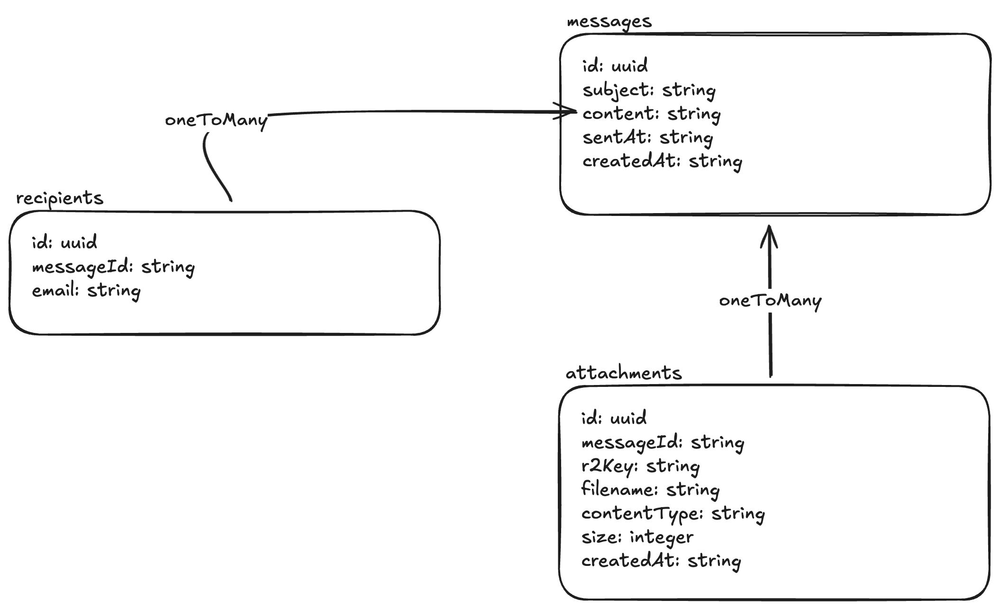
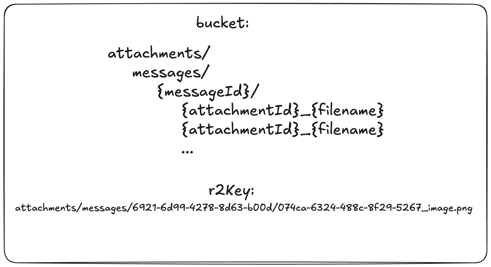

# HOW TO RUN

This project is a SvelteKit app targeting Cloudflare Workers. It exposes a small UI and a mock Microsoft Graph Mail Service API for sending and browsing emails with attachments.
UI is built around a form with a single submit button to send a request to the API and a list of messages that were sent.
There is no need to send the requests manually, as the UI will automatically send it after the form is submitted.

However, the API responses are displayed in the UI in a widget, so you can see the actual response (code, method and/or erros messages) from the API.

Maybe I misunderstood the task, and I had to make a mock UI as MS Graph sandbox for request/response sending. If so, then the implementation is not what you expected :(

#### Demo -> https://mock-ms-graph-mail-service.mocked-ms-graph-mail.workers.dev/

## Prerequisites
- Node.js (check `.nvmrc`)
- Cloudflare Wrangler CLI

## Step-by-step: Local run (full stack with D1 + R2)
1. Install dependencies:
   ```sh
   npm install
   ```
2. Apply database migrations (local D1 will be created automatically):
   ```sh
   npx wrangler d1 migrations apply d1-mail-service --local
   ```
3. Miniflare creates a local R2 bucket automatically:
4. Build the worker output:
   ```sh
   npm run build
   ```
5. Start the Cloudflare Worker locally:
   ```sh
   npx wrangler dev --local
   ```
6. Open the local URL printed by Wrangler (usually `http://localhost:8787`).

## Deployment
1. Login via wrangler CLI:
   ```sh
   npx wrangler login
   ```
2. Create the D1 database:
   ```sh
   npx wrangler d1 create d1-mail-service
   ```
3. Create the R2 bucket:
   ```sh
   npx wrangler r2 bucket create r2-mail-service
   ```
4. Apply migrations to the remote D1:
   ```sh
   npx wrangler d1 migrations apply d1-mail-service
   ```
5. Build + deploy to Workers:
   ```sh
   npm run build
   npx wrangler deploy
   ```
   
## Optional: Local UI-only dev server
If you only need the UI and do not call API routes, you can run:
```sh
npm run dev
```
Note: API routes require Cloudflare bindings (D1 + R2), so they only work when running via `wrangler dev`.

## Tests
- Unit tests:
  ```sh
  npm run test:unit
  ```
- End-to-end tests (requires Playwright browsers installed):
  ```sh
  npx playwright install
  npm run test:e2e
  ```

## API summary
All routes are under `/api/v1.0`:
- `POST /api/v1.0/send-email`
  - `multipart/form-data` fields: `subject`, `content`, `recipients` (comma-separated), `attachments` (0..n files)
  - Returns `202` on success.
  - Returns `400` on failure: ZOD validation fail and recipient limits achieved (max 3) `LIMIT_RECIPIENTS`.
  - Returns `413` on failure: `FILE_TOO_LARGE`.
  - Returns `500` on failure: `INTERNAL_DB_ERROR`.
- `GET /api/v1.0/messages`
  - Returns a list of messages (summary).
  - Returns `200` on success.
- `GET /api/v1.0/messages/{id}`
  - Returns message details with recipients and attachments.
  - Returns `200` on success.
- `GET /api/v1.0/attachments/{id}/download`
  - Streams the attachment file from R2.
  - Returns `200` on success: file found/downloaded.
  - Returns `404` on failure: file not found.

## Architecture
### High-level flow
1. UI sends a form-data request to `POST /api/v1.0/send-email`.
2. The API validates input with Zod.
3. `MailService` orchestrates:
   - D1 inserts for messages, recipients, and attachments (batched for atomicity).
   - R2 upload for attachment file bodies.
4. UI lists messages and shows details via API GET routes.
5. Attachments are fetched directly from the download endpoint.

### Main components
- **SvelteKit UI**
  - `src/routes/(app)/+page.svelte`: send form + latest list messages.
  - `src/routes/(app)/messages/[id]/+page.svelte`: message detail + downloads.
  - `src/lib/components/api-monitor`: widget to show API response logs in the UI.
- **API endpoints**
  - `src/routes/(api)/api/v1.0/*`: JSON and download handlers.
- **Service layer**
  - `src/lib/server/services/mail.service.ts`: business logic and validation rules.
- **Repositories (D1/R2)**
  - `src/lib/server/repositories/*`: database and R2 access.
- **Dependency wiring**
  - `src/hooks.server.ts` + `src/lib/server/di/container.ts` bind D1 + R2 into services.

### Data storage
- **D1 (SQLite)**: `messages`, `attachments`, `recipients`
- **R2**: attachment file content
- Migrations live under `migrations/`

### Data model
1. SQL based due to D1 is sqlite
2. R2 used for attachments.
3. ERD-schema - entities:
    - `Messages`:
        - `id`: unique message ID
        - `subject`: message subject
        - `content`: message content
        - `sendAt`: sending timestamp
        - `createdAt`: creation timestamp
    - `Attachments`:
        - `id`: unique attachment ID
        - `messageId`: FK to `Message`
        - `r2Key`: R2 object key
        - `filename`: attachment filename
        - `contentType`: MIME type
        - `size`: file size in bytes
        - `createdAt`: creation timestamp
    - `Recipients`
        - `id`: unique attachment ID
        - `messageId`: FK to `Message`
        - `email`: recipient email
        - `createdAt`: creation timestamp
4. 
5. 

### Data structures
1. Entities:
   - `Message`:
     - `id: string`
     - `subject: string`
     - `content: string`
     - `sentAt: string`
   - `Attachment`:
     - `id: string`
     - `messageId: string`
     - `r2Key: string`
     - `filename: string`
     - `contentType: string`
     - `size: number`
     - `createdAt: string`
   - `Recipient`:
     - `id: string`
     - `messageId: string`
     - `email: string`
     - `createdAt: string`
2. Dtos:
   - `MailDto`:
     - `subject: string`
     - `content: string`
     - `recipients: string[]`
     - `attachments?: File[]`
   - `MessageDto`:
     - `id?: string`
     - `subject: string`
     - `content: string`
     - `sentAt?: string`
     - `attachments?: AttachmentDto[]`
     - `recipients?: RecipientDto[]`
   - `AttachmentDto`:
     - `id?: string`
     - `messageId?: string`
     - `filename: string`
     - `contentType: string`
     - `size: number`
     - `downloadUrl?: string`
   - `AttachmentDownloadDto`:
     - `AttachmentDto` fields
     - `file: R2ObjectBody`
   - `RecipientDto`:
     - `id?: string`
     - `messageId?: string`
     - `email: string`
3. Shared:
   - `BatchResponse`:
     - `id: string`
     - `statement: D1PreparedStatement`
     - `r2Key?: string`
4. Form input:
   - `subject`: string
   - `content`: string
   - `recipients`: string (comma-separated)
   - `attachments`: FileList (0..n files)

### Data structures (explanation)
- id: unique identifier for the entity.
- dates (right now I don't use them in business logic, and they are uses as they are stored in the DB as string). Further development might require their parsing to the Date object:
  - sentAt: stringified timestamp when the message was sent. tells the user when the email was actually delivered.
  - createdAt: stringified timestamp when the entity was created. UI does not care about this field, it's used for possible further server operations. currently it does not do anything.
- messageId: FK to the parent entity (message).
- r2Key: R2 object key.
- downloadUrl: URL to download the attachment file from R2 (url to server API).
- `recipients` in Form input: comma-separated list of email addresses, it is easier to parse and validate. literally the same practices as in the UI of actual email clients.
- `attachments` in Form input: FileList of files to upload.
- `BatchResponse`: used to return multiple batches (and id with optional r2Key value) from a single database operation. to be able to execute later in a parent service.
used only in operations that require multiple inserts (e.g. `MailService.sendEmail`).
- `D1PreparedStatement`: used to execute multiple statements in a single database operation.
- `R2ObjectBody`: used to store file contents in R2.
- `...Dto`: data transfer objects (used to transfer data between layers).
- `...`: other fields are just regular strings that store the data
- `downloadUrl`: generated from `attachmentId` and points to the API endpoint used to download the file —
  `/api/v1.0/attachments/074ca60d-6324-488c-8f29-52679a56d4d9/download`

## Pros
- Clear separation of concerns (routes -> service -> repositories).
- Uses Cloudflare-native storage (D1 + R2) for a realistic mock.
- Batched database operations ensure full transactional atomicity since no ORM is used to automatically insert nested objects into the database.
- Easy to scale. Architecture provides a good foundation for future improvements by using encapsulated services and repositories.
- Easy to test. Unit tests cover most of the service layer, while end-to-end tests cover the UI and API routes.

## Cons / current limitations
- Hard limits: max 3 recipients and 4 MB per file.
- No identity (assumes that all "emails" are sent from a single account)
- Emails are not delivered to real recipients due to imitation of a real service MS Graph Mail Service. No SMTP server is used.
- Limited validation on attachment types (only size checks in service).
- No app identity (default assets are used)
- No separation for environments' mode.

## Future improvements
- Add identity to emulate the MS Graph Mail Service more closely.
- Add an SMTP server to deliver emails to real recipients.
- Support paging, filtering, and sorting on message lists.
- Background processing for large attachments or virus scanning.
- Better attachment type validation and UI feedback.
- Add message delete/update flows and recipient search.
- Add email sending status (draft, sent, failed, etc.)
